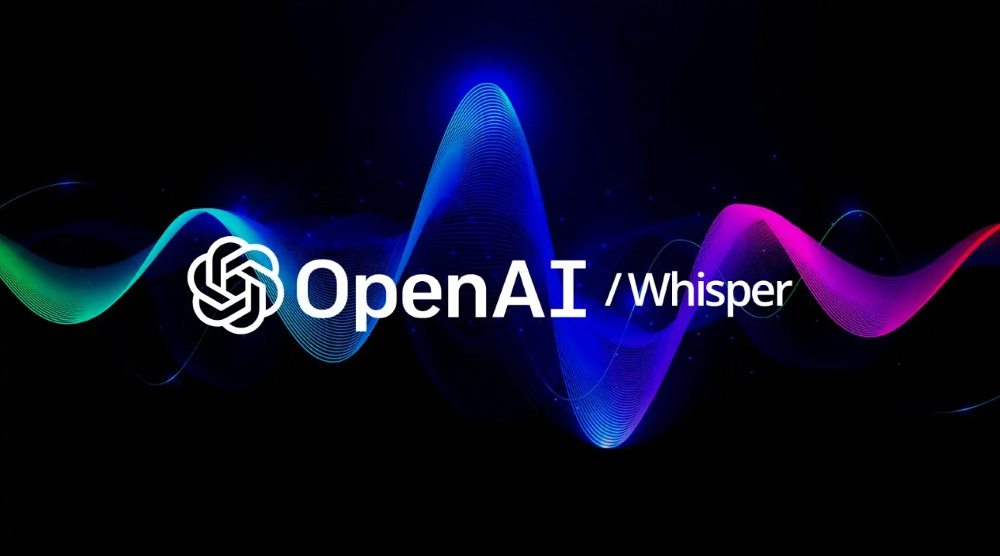

# Conversando Por Voz Com o ChatGPT Utilizando Whisper (OpenAI) e Python

Neste desafio proposto pela DIO foi criado um script que recebe um áudio, pesquisa a pergunta enviada no áudio utilizando inteligência artificial e devolve outro áudio como resposta.

O script original utilizava ChatGPT e Whisper, ele se encontra na pasta original. O script foi alterado, substituindo os dois pelo Gemini.

Conteúdo recomendado:

**Conversando Por Voz Com o ChatGPT Utilizando Whisper (OpenAI) e Python**

https://web.dio.me/articles/conversando-por-voz-com-o-chatgpt-utilizando-whisper-openai-e-python

**Código-fonte deste Desafio de Projeto (Lab) no Google Colab**

https://colab.research.google.com/drive/1rHGq5N-sbEGtZsNUiQFT8q60BhRbj99b?usp=sharing

**Live completa deste projeto**

https://www.youtube.com/watch?v=3ojLFBipm5U

